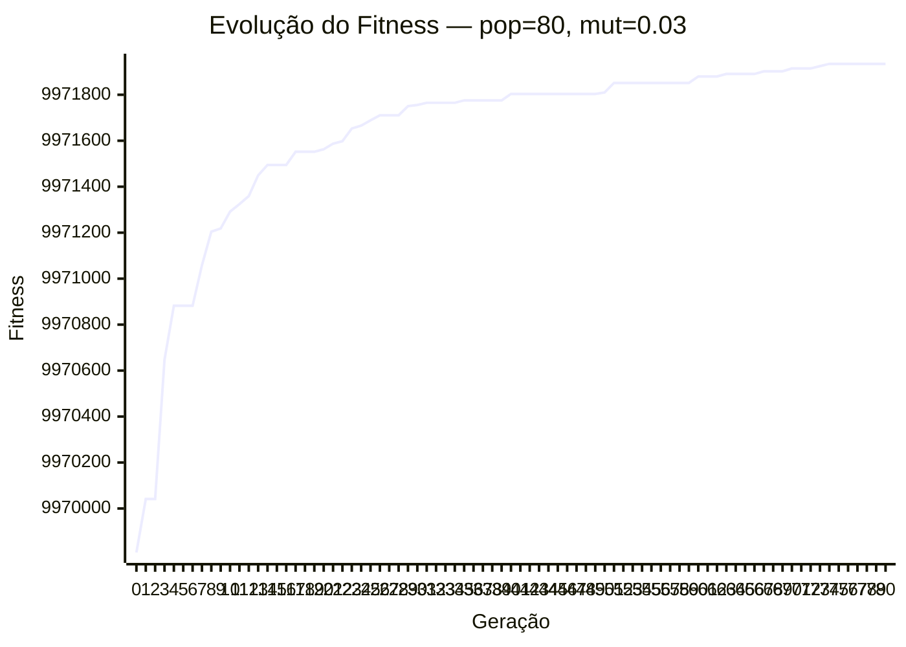
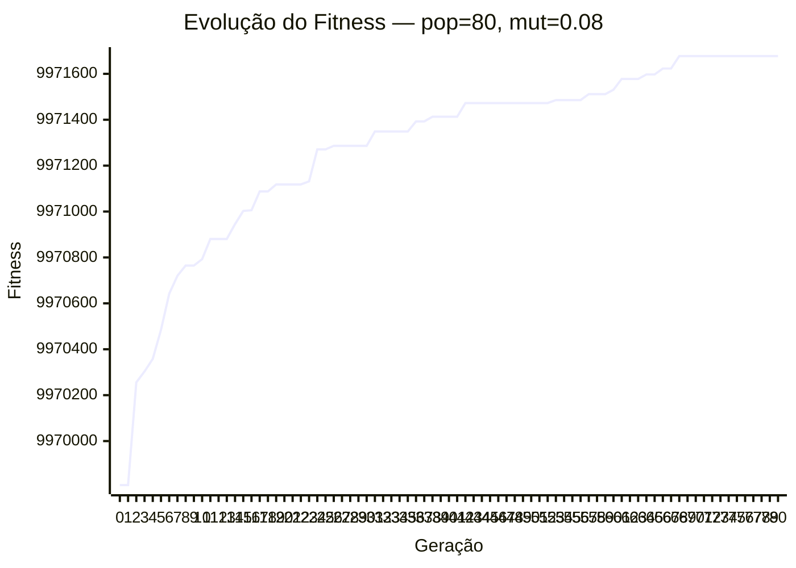

# Estudo de hiperparâmetros

## Configuração experimental

| Parâmetro | Valor |
|---|---|
| Populações testadas | 80, 120 |
| Taxas de mutação testadas | 0.03, 0.08 |
| Gerações máximas | 80 |
| Critério de convergência | Estagnação por 25 gerações |
| Taxa de crossover | 0.85 |
| Seleção | tournament |
| Crossover | two_point |
| Elitismo | 4 |
| Seed | 42 |

## Resultados por combinação

| Tamanho da população | Taxa de mutação | Melhor fitness alcançado | Gerações até convergência | Número de violações da solução final |
|---|---|---|---|---|
| 80 | 0.03 | 9971934.50 | 80 | 0 |
| 80 | 0.08 | 9971677.40 | 80 | 0 |
| 120 | 0.03 | 9972017.50 | 80 | 0 |
| 120 | 0.08 | 9971738.50 | 80 | 0 |

## Discussão

- Populações maiores tendem a gerar diversidade adicional, mas aumentam o custo computacional por geração.
- Taxas de mutação moderadas costumam equilibrar exploração e estabilidade; taxas muito baixas podem prender o AG em soluções com custo maior.
- A combinação escolhida para o README deve priorizar zero violações e bom fitness final, não apenas convergência rápida.

## Convergência — pop=80, mut=0.03

## Convergência — pop=80, mut=0.08

## Convergência — pop=120, mut=0.03

## Convergência — pop=120, mut=0.08

